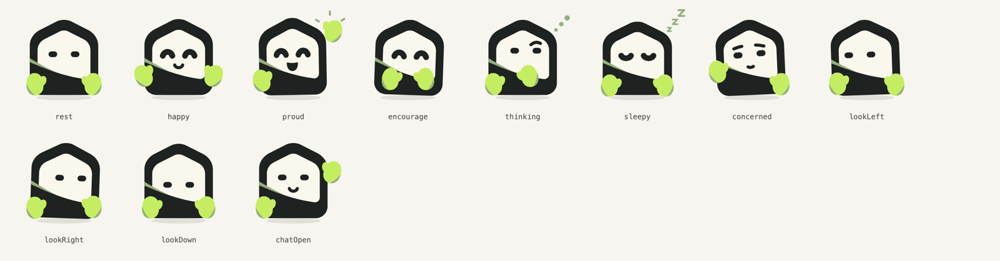
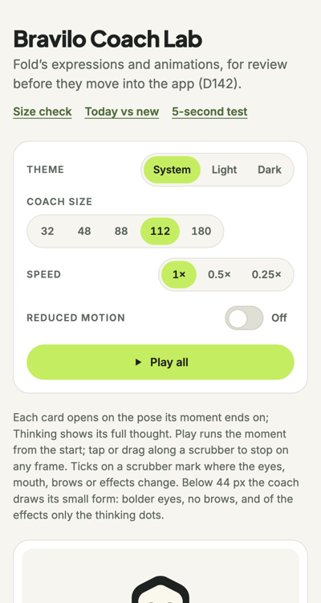
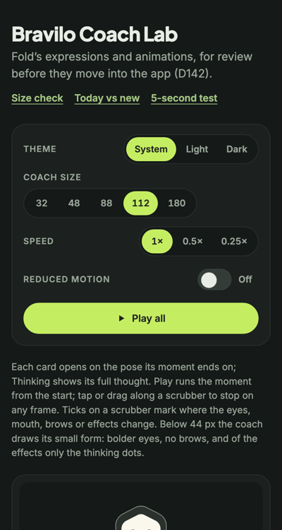
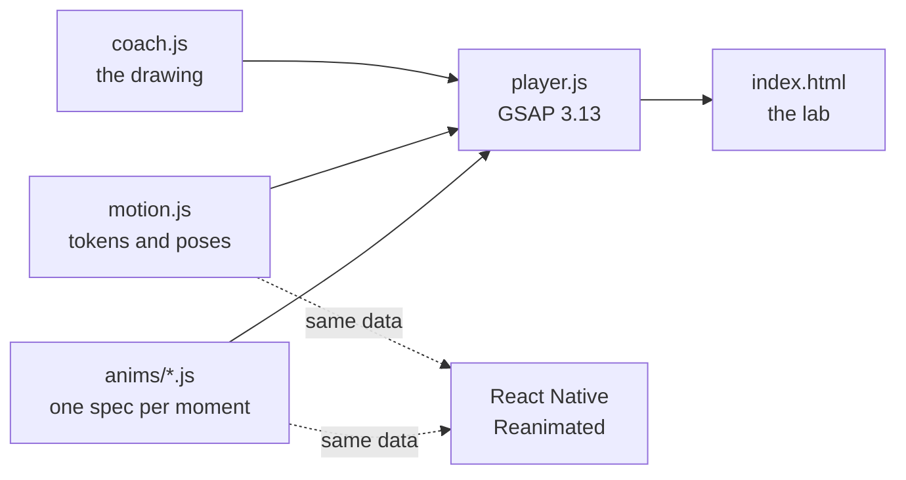

<div align="center">

# Bravilo Coach Lab

**A friendly coach character, thirteen small moments of feeling, and a lab to try them on your phone.**

The coach from [Bravilo](https://bravilo.app), the gym coach for beginners and people starting again,
drawn as SVG and animated with plain data that a web page and a React Native app can both replay.



</div>

---

## Why this exists

Bravilo's coach used to have one face. A coach that can't look pleased when you finish, or calm when
something hurts, can't do its job. This lab gives it a range of feelings, built **outside the app**
so they can be seen, tested and agreed on before any app code changes.

The rules it follows come from the app's emotional design:

- **Pride, not guilt.** The coach celebrates what you did. It never sulks, nags or looks
  disappointed.
- **Small and purposeful.** Each moment plays once, for a reason. Nothing idles or loops, except
  thinking while a reply is on its way.
- **One coach moves at a time.** Only one coach animates on a screen.
- **Reduce Motion is respected.** With it on, the coach shows the moment's final pose and doesn't move.
- **It reads at every size,** from a 24 pt tab icon to a 180 pt welcome screen, in light and dark.

## Try it

Open **`index.html`** in a browser. It's a single file with everything inlined except GSAP, which
loads from cdnjs. Or deploy the folder as a static site: `vercel.json` rebuilds the lab page and serves the repo root, and needs no dependencies.

| | Light | Dark |
|---|---|---|
| The lab on a phone |  |  |

In the lab you can:

- **Play every moment,** or drag its scrubber to stop on any frame. Ticks mark where the
  expression changes.
- **Change the theme, size and speed.** Slow motion (0.5× and 0.25×) is the best way to judge
  timing.
- **Press the coach button** in a mock tab bar. It squashes under your finger and raises a hand
  as the chat opens, just like the app.
- **Compare** today's coach with the new one at 32, 48 and 112 px.
- **Run the 5-second test.** A random moment plays for 5 seconds with no label, then you pick the
  feeling you saw. If people can't name it, the moment isn't clear enough yet.

## The moments

| Moment | Where it plays in the app | What you see |
|---|---|---|
| **Rest** | everywhere, by default | calm and present (a still pose) |
| **Greeting** | welcome screen, empty chat | a small hop and a wave, happy eyes |
| **Nod** | something saved, plan updated | "got it": a dip and a quick happy blink |
| **Thinking** | while the coach replies (the only loop) | eyes up, mitten at the chin, dots build one by one |
| **Happy** | finish screen | a pleased hop, happy eyes, a small smile |
| **Proud** | a new best, milestones | wind-up, stretch, one mitten punches high, a tiny spark |
| **Encourage** | before a workout, after a gap | a lean in, two fists forward, a firm nod |
| **Sleepy** | rest-day card | one slow breath, eyes close, small z's drift up |
| **Welcome back** | coming back after a break | eyes widen, arms open "there you are", then happy |
| **Concerned** | "something feels off", pain follow-up | a kind tilt, worried brows, a gentle raised hand |
| **Surprised** | a new best beyond the plan | a pop, wide eyes, an "o", then settling to happy |
| **Look at** | onboarding: pointing out a button | the eyes lead, the body follows (left, right, down) |
| **Press** / **Chat open** | the coach button in the tab bar | a squash and spring, then a raised hand and a smile |

Every one-shot lasts 1.25 seconds or less and ends exactly on its pose.

## How it works

The character, its motion and the player are kept apart. That's what lets the same animations
move into the iPhone app later.



### 1. The character is SVG with named parts

`coach.js` draws the coach as ten groups: `root`, `body`, `face`, `eyes`, `mouth`, `brows`, `handL`,
`handR`, `fx` and `shadow`. Each part has a **pivot**, the point it turns and scales around. The
mittens pivot at the wrist, so a rotation is a wave.

Expressions are **variants**: the eyes have `rest`, `happy`, `wide`, `closed` and four look
directions, and the mouth, brows and effects have a few each. Exactly one variant per group shows at
a time. Below 44 px the coach switches to a bolder **small mode** so it still reads in a tab bar.

Every shape is a plain `<path>`, with no masks, filters or gradients, so it copies into
react-native-svg unchanged. Colours are CSS variables, so a theme swaps colours and nothing else.
The face stays cream with dark eyes in both themes.

```js
const coach = BraviloCoach.create(document.querySelector('#stage'), { theme: 'dark', size: 112 });
coach.setVariant('eyes', 'happy');
```

### 2. Animations are data, not code

GSAP and three.js don't run in React Native, so no animation is written as GSAP calls. Each moment
is a small spec: tracks of keyframes for a part's position, rotation, scale or opacity, plus timed
swaps between expressions.

```js
BraviloMotion.ANIMS.nod = {
  id: 'nod', durationMs: 500, loop: false, endPose: 'rest',
  tracks: [
    // [time in ms, value, ease into this key]
    { part: 'body', prop: 'scaleY', keys: [[0, 1], [150, 0.955, 'standard'], [430, 1, 'spring']] },
    { part: 'face', prop: 'y',      keys: [[0, 0], [180, 4.5, 'standard'], [460, 0, 'standard']] },
    { part: 'eyes', prop: 'scaleY', keys: [[0, 1], [70, 0.15, 'in'], [140, 1, 'out'],
                                           [280, 1], [340, 0.15, 'in'], [410, 1, 'out']] }
  ],
  swaps: [[70, 'eyes', 'happy'], [340, 'eyes', 'rest']]   // hidden inside the blinks
};
```

Eases come from four named cubic-bezier curves (`standard`, `out`, `in` and a gentle `spring`), and
durations from the app's tokens (150, 220 and 320 ms). A change of expression hides inside a quick
blink, so nothing pops.

### 3. A small player turns specs into motion

`player.js` builds a GSAP timeline from a spec, with no logic for any particular animation:

```js
BraviloPlayer.play(coach, 'proud', { onDone: () => console.log('done') });
BraviloPlayer.seek(coach, 'proud', 0.5);   // paused halfway, for scrubbing and screenshots
BraviloPlayer.stop(coach);                 // eases to the end pose in 220 ms
BraviloPlayer.reducedMotion = true;        // play() now shows the end pose at once
```

It also exposes `sample(anim, tMs)`, which computes any frame from the spec alone, without GSAP.
That's the reference a port has to match.

## Project layout

```
coach.js            the character: parts, pivots, variants, themes, small mode
motion.js           timing tokens and the static poses
anims/              one file per moment; each registers itself in BraviloMotion.ANIMS
player.js           the GSAP player: play, seek, stop, to, sample, validate
lab-src.html        the lab page's source
index.html          the built lab (a full page, for a static host or opening locally)
artifact.html       the same lab as a fragment, for publishing as a claude.ai artifact
sheet.html          the character sheet: every variant, pose and size, with ?selftest=1
frames.html         contact sheets: ?anim=nod&n=10&theme=dark&size=112, or anim=poses / variants / all
contract-test.html  485 checks that the character keeps its contract
SPEC.md             the contract every file here follows
PORTING.md          how this moves into the React Native app
candidates/         the two earlier character designs the final one was built from
judge-*.html        retired pages used to score those candidates
ref/                the reference images the character came from
tools/              the build script and screenshot helpers
vendor/             a local copy of GSAP for offline checks
```

## Working on it

There's nothing to install to view it: open any page in Chrome or Safari. To change the lab page
itself:

```bash
node tools/build-lab.mjs
```

That inlines `coach.js`, `motion.js`, every `anims/*.js` and `player.js` into `lab-src.html`, and
writes `index.html` and `artifact.html`. Rebuild after any change to those files.

Before calling a change done:

- **The contract holds:** `contract-test.html` and `sheet.html?selftest=1` report all pass.
- **Every spec validates:** `frames.html?anim=all` checks each animation against the motion contract
  and checks the player against `sample()` on every frame.
- **It looks right:** take contact sheets with the headless Chrome helper and look at them in light,
  dark and at 32 px.

```bash
tools/shot.sh frames.html "anim=proud&n=10&theme=dark&size=112" out/proud-dark.png 1400 600
tools/console.sh index.html          # prints any console errors
```

`tools/shot.sh` can't go narrower than about 500 px. For true phone widths, use
`node tools/phone-shot.mjs` after `npm install` (it uses Playwright).

### Adding a moment

1. Add its row to `SPEC.md` §4: where it plays, how it should feel, and its end pose.
2. Add the end pose to `POSES` in `motion.js` if it's new.
3. Write `anims/<id>.js`. Start every track at the start pose and end it exactly on the end pose.
   Use only the token eases, and hide eye swaps inside a blink.
4. Check it with `frames.html?anim=<id>`, add it to `MOMENTS` in `lab-src.html`, and rebuild.

## Moving it into the app

[`PORTING.md`](PORTING.md) is the guide. In short:
- The drawing and the motion data are exported to JSON once.
- The parts become react-native-svg `<G>` groups.
- One Reanimated clock per coach replays the same keys with `Easing.bezier`.
- Tests compare its frames against the lab's `sample()`.

What's approved in this lab is what ships.

## Built with

- [GSAP 3.13](https://gsap.com) for the browser player
- Plain JavaScript and SVG, with no framework and no build step beyond inlining the lab page
- Headless Chrome for screenshots and checks

## License

All rights reserved. The Bravilo coach character, its expressions and the Bravilo name are part of
the Bravilo brand. Please ask before reusing them.
